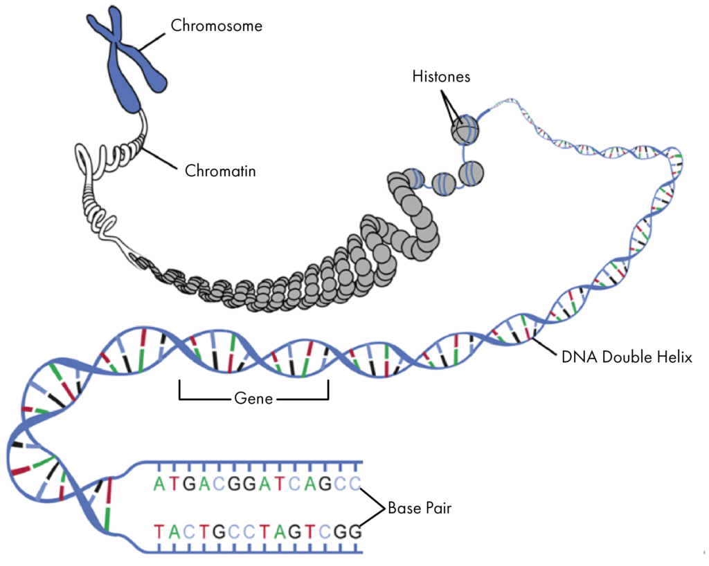
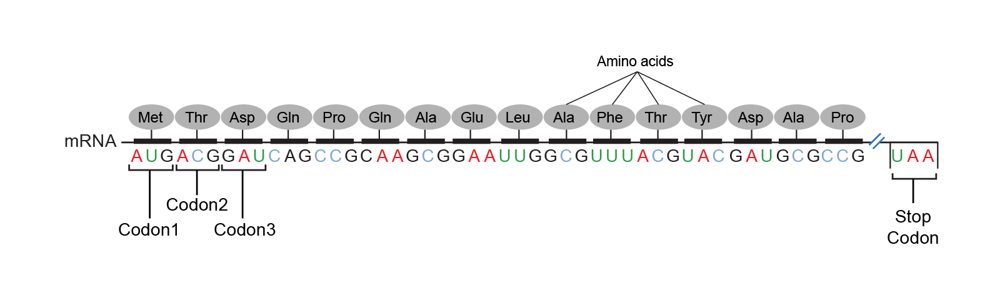
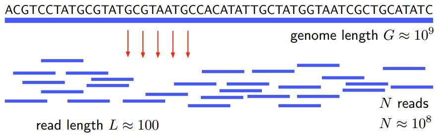
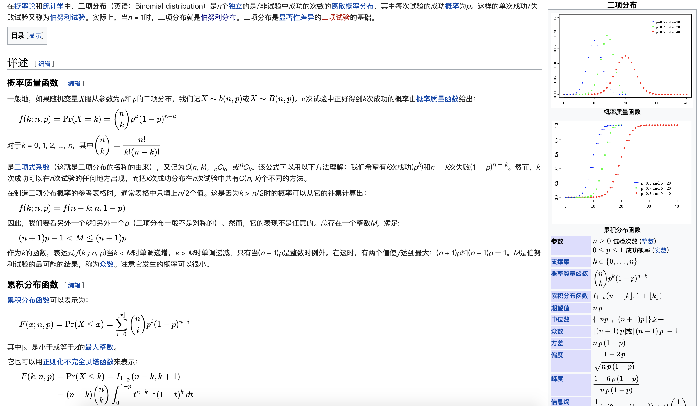
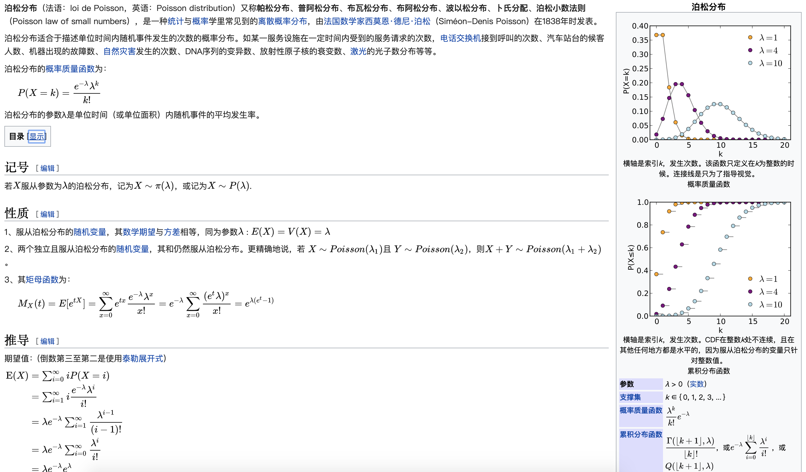
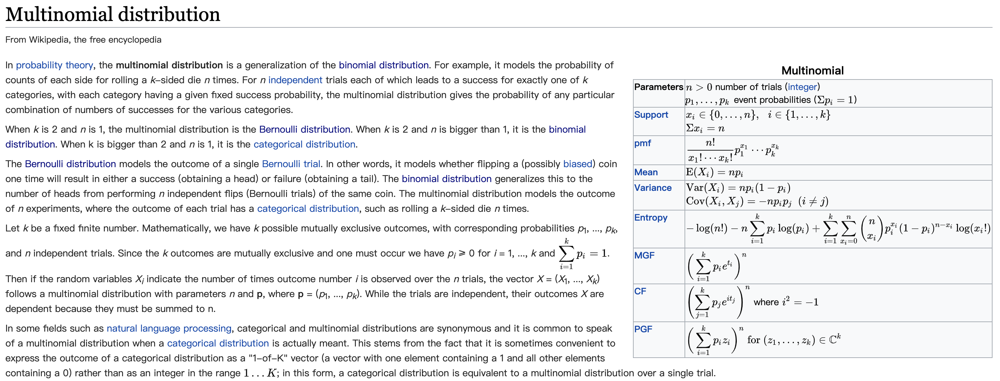

# Generative Models for Discrete Data 广义模型和离散数据 {#intro}

## 本章概述

这一章从介绍概率、不同分布开始，假设各种符合某分布的数据，主要以DNA、碱基等为描述对象。原书中的说法是 top-bottom 的方式，从我们了解的各种概率分布（top）开始，设计符合这些分布原则的具体问题，如碱基分布模式等。当然这是一种理想化的训练，实际的问题多是反方向 bottom-top 的，通过分析实际数据获取数据规律，或者建立模型。

本章主要目标包括：

*   获取特定模型下所有可能结果的概率，并将理论值与实际数据比较。
Learn how to obtain the probabilities of all possible outcomes from a given model and see how we can compare the theoretical frequencies with those observed in real data.

* 通过一个完整示例，了解如何应用泊松分布分析抗原数据。   
Explore a complete example of how to use the Poisson distribution to analyse data on epitope detection.

* 如何应用泊松分布、二项式分布、多项式分布模型来做实验。  
See how we can experiment with the most useful generative models for discrete data: Poisson, binomial, multinomial.

* 使用R函数计算概率和偶发事件。  
Use the R functions for computing probabilities and counting rare events.

* 生成符合特定分布的随机数。   
Generate random numbers from specified distributions.

有一点比较疑惑 —— 统计理论可以藏得多深？这里找的一些例子和统计分布关系密切，但之前一些相关、回归、降维的分析，基本涉及不到统计分布的知识。希望通过学习能把这些之间的内在联系搞清楚一点。

## 回顾一点概率论与数理统计

看这一章，感觉有些概念不清楚，再去学陈希孺老先生的的《概率论与统计统计》。

```{r , fig.cap='陈希孺老先生的概率论与数理统计', fig.align='center',  out.width='60%', echo=FALSE}

```

带着点问题重新硬着头皮读，才发现这真的如同很多牛人推荐的，是一本神仙书。原来读的时候太功利，总想翻上几页就能拿去在R语言上套函数解决实际问题了，可看了看都是理论性的东西用不上，就丢到一边。现在再看，才发现老先生真是不紧不慢、娓娓道来，从“道”的高度把概率论和数理统计的有关概念、发展历程、应用场景等等系统的解释一遍。虽然是入门书，但好多领域的拓展也有谈及，用平实的语言勾画了宏大的场景，让人越读越有跪感。

名词 | 定义 | 原书涉及
--|--|--
试验/Trial | 要有明确界限，宽泛的可以包含“观察”。全部结果是试验前即明确的，如抛硬币2面，掷骰子6点，事件发生概率为0到正无穷。| Tossing a coin has two possible outcomes. This simple experiment, called a Bernoulli **trial**, is modeled using a so-called Bernoulli random variable.
事件/envent| 一个明确的陈述，界定了试验全部可能结果中一确定的部分，这个陈述或这一确定的部分，即一个事件。| In molecular biology, many situations involve counting **events**.

古典概率计算归结为计算两个数M和N，这种计算多涉及排列组合。如n个不同物体，取r个的排列数是 $P_r^n = n(n-1)(n-2)...(n-r-1)$，而不同组合数则为$C_r^m = P_r^n/r!=n!/(r!()n-r)!$ ，这个 $C_r^m$ 又称为**组合系数**，统计上习惯用这种形式来表示：$C_r^n = \binom{n}{r}$。

组合系数 $C_r^m$ 又常称为**二项式系数**，因为常出现在下列二项式展开的公式中：
$$(a + b)^n = \sum_{i=0}^{n} \binom{n}{i} a^ib^{n-i} $$
还有**多项式系数**，n个相异物分成k堆，各堆个数分别为$r_1 , r_2..., r_k$分法是。
$$n!/(r_1!...r_k!)$$
它是$(x_1 + x_2 + ... + x_k)^n$的展开式中，$x_1^{r_1}...x_k^{r_k}$这一项的系数。

不知道这几个公式和二项分布、多项分布有啥关系……不过老先生不会随便说，放着慢慢领会。

感觉清楚点了抓紧回过头看本书。概率论与数理统计晚点再学。

## 生命科学一些基础知识（直接看图）

```{r , fig.cap='DNA 展开结构示意图。染色体-染色质-组织蛋白-脱氧核糖核酸双螺旋结构-基因-碱基对', fig.align='center',  out.width='80%', echo=FALSE}

```

```{r , fig.cap='RNA上的密码子[codons](https://en.wikipedia.org/wiki/DNA_codon_table)，“how many codons use a certain spelling”', fig.align='center',  out.width='100%', echo=FALSE}

```

```{r , fig.cap='[In DNA sequencing, a read is an inferred sequence of base pairs (or base pair probabilities) corresponding to all or part of a single DNA fragment. A typical sequencing experiment involves fragmentation of the genome into millions of molecules, which are size-selected and ligated to adapters. The set of fragments is referred to as a sequencing library, which is sequenced to produce a set of reads.](https://en.wikipedia.org/wiki/Read_(biology))', fig.align='center',  out.width='100%', echo=FALSE}

```

## 本章大体框架

如原文所说，这一章是一种“从上而下”的套路练习。通过设计一些符合概率分布模型的数据，了解数据和概率之间的关系。主要讲了4种分布：

* 伯努利分布（Bernoulli distribution），是二项式分布的特殊形式（n = 1）又称两点分布或者'0-1'分布，要么成功是1，要么失败是0，只有一种可能。

* 二项式分布（**binomial distribution**），二项分布即重复n次的伯努里试验，典型例子是扔硬币，硬币正面朝上概率为p, 重复扔n次硬币，k次为正面的概率即为一个二项分布概率。按陈先生的思路，这就是一个排列组合问题：要在扔n次中有k次成功，成功概率为p，则失败概率为1-p，每次试验独立，则要求k个p都要发生，n-k个1-p也要发生，即 $p^k(1-p)^{n-k}$。如果不明白的话考虑一下扔硬币，正面想上的概率是0.5，扔两次正面都往上的概率是$0.5^2$，扔四次，两次正，两次反的概率是$0.5^2 * 0.5^2$。再回到n次，有k次成功，发生的位置，或者说次序可能不同，占据k个位置有$\binom n k$ 种可能，所以发生k次成功的几率为：$\binom n k p^k(1-p)^{n-k}$。这个分布和泊松分布、正态分布都有联系。n很大而p很小时，n*p趋近一个常数，就近似为泊松分 布（这个在手动计算的年代方便、好算），这两种都是离散分布。

```{r , fig.cap='二项分布的维基百科解释', fig.align='center',  out.width='100%', echo=FALSE}

```

* 泊松分布（**Poisson distribution**），泊松分布是二项分布n很大而p很小时的一种极限形式。

```{r , fig.cap='泊松分布的维基百科解释', fig.align='center',  out.width='100%', echo=FALSE}

```

* 多项分布（**multinomial distribution**）二项扩展为多项就得到了多项分布。二项分布的试验结果只有两个(成功和失败)，而多项分布的试验结果则多于两个。如果试验的结果有三个，则是三项分布；如果结果有六个，则是六项分布比如扔骰子，不同于扔硬币，骰子有6个面对应6个不同的点数，这样单次每个点数朝上的概率都是1/6（对应p1~p6，它们的值不一定都是1/6，只要和为1且互斥即可
```{r , fig.cap='多项式分布的wikipedia解释', fig.align='center',  out.width='100%', echo=FALSE}

```


## 泊松分布

原书首先介绍了泊松分布的一个示例。在一段HIV基因上，一次转录发生突变的概率为$5 × 10^{-4}$, 也就是说，一段含有10000个核苷酸（nucleotides）的HIV基因，在一次复制过程中，发生突变的核苷酸个数在5左右，标准差为$\sqrt5$。这个5，在R语言的泊松分布公式中，称为频率参数（rate parameter），写作$\lambda$。 通过确定了出现频率的泊松分布，可以计算某个频率出现的概率。如，计算这段DNA中出现3个变异的概率是多少，实现方式如下。

```{r}
dpois(x = 3, lambda = 5)
```

本来不太明白，R里面说lambda是平均数（vector of (non-negative) means.），这里是5，可能没有明确在10000里面发生5啊，那么`dpois(x = 30, lambda = 50)` 应该得到一样的值吧，可实际上差大了。why！

其实呢，这个5，其实是单位时间的平均发生率。如同“一段时间内某路口发生事故的个数”一样，其实就是n*p。$p = \lambda/n$。上面R的函数中，是知道$\lambda$是5，求发生3次的可能是多少。

结合R中的作图，和非常牛逼非常适合统计的**向量数据处理方式**，可以把泊松分布画出来。能够清晰地看到，$\lambda$是5的时候，发生0到12次的概率分别是多少。

```{r, fig.cap="发生1到12次突变的概率分布", fig.align='center'}
barplot(dpois(0:12, 5), names.arg = 0:12, col = "red")
```


## 荡开一会看R语言的函数 

在R语言中，一个概率一般有4种不同的函数，如泊松分布是这样的。

> * Density, distribution function, quantile function and random generation for the Poisson distribution with parameter lambda.


函数 | 名称
 -- | --
**dpois(x, lambda, log = FALSE)**    | 密度函数
**ppois(q, lambda, lower.tail = TRUE, log.p = FALSE)**  |  分布函数
**qpois(p, lambda, lower.tail = TRUE, log.p = FALSE)**  |  分位数函数
**rpois(n, lambda)**    |  随机数生成函数

参数 | 意义
 -- | --
x	 | vector of (non-negative integer) quantiles.
q	| vector of quantiles.
p  | vector of probabilities.
n	| number of random values to return.
lambda	| vector of (non-negative) means.
log, log.p	 |  logical; if TRUE, probabilities p are given as log(p).
lower.tail	|  logical; if TRUE (default), probabilities are P[X ≤ x], otherwise, P[X > x].

里面的 **quantiles, 分位数**，拿出来说一下，也叫分位点，就是概率分布上选的点，常用的有中位数、四分位数、十分位数、百分位数等。感觉是原来手工时代的习惯，在函数中只要是整数，往上放就行，如前面例子中用的3。就是这段基因发生突变的平均数为5，那发生3次突变的概率是多少。3怎么分位了？我要高兴随便写个100也行，就是概率小点而已。可以理解为**成功次数**。为什么叫density，就是因为只看这一次的，是密度。对应的是massive，质量，在R里面是distribution function, 如二项分布里的pbinom,就是这个次数之前累积的了。

二项分布

```{r}
dbinom(5, 10, 0.5) # 这是在0.5的概率下，扔十次硬币，5次1的概率（假设正面为1，反面为0）。

pbinom(5, 10, 0.5) # 这个次数的成功，以及之前累积的。

sum(dbinom(1:5, 10, 0.5)) # 看这个密度加起来，和上面差不多吧。

pbinom(5,10, 0.5 , lower.tail = FALSE)  # lower.tail是比5这个数大的话概率是多少。
```

再看看泊松分布，也类似。

```{r}
dpois(3, 5) # 平均发生5次，发生3次时候的概率，密度。
sum(dpois(0:3, 5)) #密度之和。
ppois(3, 5) # 总概率。和前面的密度和一致。
qpois(0.2650259, 5) # 按3的概率，计算这个概率下，能有多少次成功的，倒推出3。因为这是计算分位数，所以只能得出整数，而且概率上下稍微浮动下，也只会算出相近的分位数整数。
```

另外可以方便地生成符合分布的随机数。

```{r}
rbinom(15, prob = 0.5, size = 1) # 按照每次试验做一次，成功概率为0.5，观察15次，每次成功与否。
rbinom(1, prob = 2/3, size = 15) # 每次试验15次，成功概率为2/3，观察1次，成功了几次。
```


## 应用一个表位检测模型（a generative model for epitope detection）

有的蛋白会引发人体过敏（allergic reaction），蛋白大分子上引发过敏的位置叫表位（epitope）。面对抗原（antigen），白细胞会产生抗体（antibody）。有些抗体直接摧毁抗原，有些召集（recruit）白细胞摧毁抗原。表位是免疫系统识别抗原的关键位置，如抗体、B细胞、T细胞，大多通过表位识别抗原。

```{r , fig.cap='抗体示意图，不同颜色是免疫球蛋白', fig.align='center',  out.width='50%', echo=FALSE}
knitr::include_graphics("http://web.stanford.edu/class/bios221/book/images/Antibody_IgG2.png")
```

基于上述，看这个 [ELISA error model](https://en.wikipedia.org/wiki/ELISA)，即[酶联免疫吸附试验](https://zh.wikipedia.org/wiki/%E9%85%B6%E8%81%94%E5%85%8D%E7%96%AB%E5%90%B8%E9%99%84%E8%AF%95%E9%AA%8C)，用来检测某蛋白不同位置的特定表位。该模型有以下假定：
> * 一般人都能检测出敏感表位，叫噪声值，检测到的概率为0.01，检测到表位标记为1.

> * 在100个不同位置检测某蛋白，检测相对独立。

> * 本章检测50个病人的样本。

先做个符合设定的一个病人的分布。

```{r}
rpois(100, 0.01)
```

如果每个病人的过敏表位都泊松分布的，那么50个病人的数据加起来，数据也应该符合泊松分布，只不过检测到的概率成了0.01*50=0.5，类似下面这样的分布。

```{r}
rpois(100, 0.5)
barplot(rpois(100, 0.5), width = 0.7, xlim = c(-0.5, 100.5))
```

如果个别位点特别容易检测到表位，那肯定就不符合泊松分布了，需要进行计算分析。载入书中所给数据。

```{r}
load("data/e100.RData")
e100
barplot(e100, ylim = c(0, 7), width = 0.7, xlim = c(-0.5, 100.5),
  names.arg = seq(along = e100), col = "darkolivegreen")
```

一看，有点不正常，50个人里居然有7个在某位点检测到表位，这符合泊松分布吗？这就是计算平均值为0.5的时候，密度为7的概率。我的第一反应是这样算：

```{r}
dpois(7, 0.5)
```

但书中绕了个圈，不但没说这么算，$ppois(6, 0.5, lower.tail = FALSE)$ 也不对，应该计算100个$\lambda =0.5$的泊松分布中，最大值大于等于7的概率。这就是$1-\prod_{i=1}^{100} P(x_i \leq 6 )$，也就是$(1-\epsilon)^{100}$。注意这个epsilon在数学里经常用来表示一个很小的数。经过
，或者用模拟（simulation）算，这里用的蒙特拉罗方法（Monte Carlo method）。

```{r}
maxes = replicate(100000, {
  max(rpois(100, 0.5)) # 取泊松分布的最大值，重复10000次。
})
table(maxes)
```

这里面大于等于7的个数，除以10000，就是用模拟算出来的，符合泊松分布出现大于等于7的概率。

```{r}
mean(maxes >= 7) # 处处炫技，括号里是10000个逻辑值，计算时候FALSE是0， TRUE是1，平均出来概率。
```

可以看到，和我想的方法相比，虽然都很小，但是有数量级的差别。至于为什么先存疑。另外，用模拟的方法计算，精度受到模拟次数的限制。这很好理解，比如做10000次模拟，只能除以10000，没法达到更小的数位，所以不能得到0.00000000123这样的结果。

## 多项分布（Multinomial distribution）

当一次试验有大于2个结果时，就要引入多项分布。同样，一次试验的多个结果要有互斥、加和为1等特点。如一种产品分成几种等级，一段基因有4种碱基等情况。

```{r , fig.cap='多项式模型', fig.align='center',  out.width='50%', echo=FALSE}
knitr::include_graphics("http://web.stanford.edu/class/bios221/book/images/BallsinBoxes4.jpg")
```

原书中在推导了多项分布的公式后，提出一个问题：球落到4个盒子之一的问题，如果落到各盒子的几率相等，那么观察到4个球落到第一个盒子，2个球落到第二个盒子，其他两个没有的概率是多少。

$$\begin{equation*}
P(4,2,0,0)=\frac{6\times 5\times 4\times 3\times 2}{4\times 3\times 2 \times 2}
\frac{1}{4^6}
=\frac{15}{4^6}\simeq 0.0037.
\end{equation*}$$

```{r}
dmultinom(c(4, 2, 0, 0), prob = c(0.25, 0.25, 0.25, 0.25))
```


## 多项分布的权重（power）

这一部分没看太明白，先放着，往后看。

主要涉及解决“需要多大样本量”的问题。通过蒙特拉罗方法，确定我们需要多大的样本量，才能检验概率相等一个多项分布模型，是否与实际数据一致。


