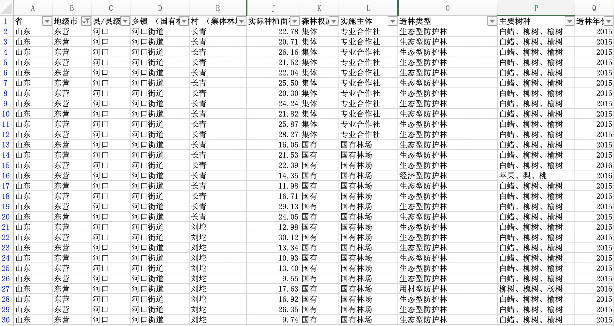

--- 
title: "读Modern Statistics for Modern Biology随记"
author: "王强"
date: "`r Sys.Date()`"
site: bookdown::bookdown_site
output: bookdown::gitbook
documentclass: book
bibliography: [book.bib, packages.bib, introduction.bib]
biblio-style: apalike
link-citations: yes
github-repo: ecowang/M for M
description: "学习Modern Statistics for Modern Biology记录"
---

# Introduction 引言

## 一些背景

[Modern Statistics for Modern Biology](http://web.stanford.edu/class/bios221/book/index.html)这本书，是斯坦福大学[Susan P. Holmes](https://profiles.stanford.edu/susan-holmes) 教授和 [欧洲分子生物实验室](https://www.embl.org/)的[Wolfgang Huber](https://www.huber.embl.de/) 教授共同编写的。两位都是大牛，追求他们的文章可以发现学科发展趋势的那种。

Holme教授在斯坦福大学暑期学校也教[这门课](http://web.stanford.edu/class/bios221/about.html)，课程时长才[十来天](http://web.stanford.edu/class/bios221/TimesCourse.html)。我本想找找有没有视频跟着学学，不过一直没找到，只好跟着书学，并在这里写一些记录。

## 本书目标

> The aim of this book is to enable scientists working in biological research to quickly learn many of the important ideas and methods that they need to make the best of their experiments and of other available data. 

原书的目的是让生命口的工作者**很快地**学会能用于其实验和数据的重要理念和方法，这也是我想获取的技能。感觉强大的数据分析能力是一把手术刀，能突破学科壁垒，快速了解关键问题，并产出相对专业的成果；又如同包装设计师，一样的研究结果，用一些更加深入的统计工具来分析，或者以更加直观的统计图来呈现，会让人更有好感，更值得信赖、更容易接受。好像同一个小伙，了解女孩想事儿的套路了，则什么类型的姑娘都容易聊起来；再好好捯饬下自己，更容易获得她们的欣赏……大雾。

学习本书需要什么样的知识背景呢？我的感觉，基本生命专业的本科生都可以，有实际需求的最好。因为它并不涉及系统的统计背景知识，主要是对工具使用方法的学习，说白了就是培训“工匠技能”，有点数学基本知识、生物学背景再了解点R语言的皮毛，上就是了。不太熟的，上多了也就熟了。

所以，解决实际问题，也是本人的学习导向。首先要明确解决的问题是什么。有时候把问题定义清楚了，也就解决一半了。定义问题和解决问题的过程包括：

* 1. 知道哪些前提数据
* 2. 前提数据的表现形式、存储格式等
* 3. 要分析的目标、方向
* 4. 使用的工具（模型、包、函数）
* 5. 结果的意义、表现形式（图、表、显著性等）

知道前提数据，并了解它们的表现形式，是很重要的环节。Susan在书中提出应对数据的**差异性**（[The challenge: heterogeneity](http://web.stanford.edu/class/bios221/book/introduction.html)），也说明生命学科不同细分领域产生数据的多样性和差异性令人挠头。当然R语言作为一种语言，应对这种差异性再合适不过——语言嘛，见人说人话见鬼说鬼话就是了，前提是我们要大致了解这些神神鬼鬼，并学会一定的说话套路。

## 主要内容

### 统计江湖的套路

首先作者放着这么一张图，统计学经典流程：做出原假设、实验检验、计算显著性（p值）、得出结论（原假设是否可靠）。并在图上有所创新，把原假设概念拓展到模型的宽度。

```{r , fig.cap='这是Fisher提出的原假设检验过程。本书中可以把Hypothesis H0，想象成要拟合的模型，分析过程类似', fig.align='center', out.width='25%', echo=FALSE}
knitr::include_graphics("http://web.stanford.edu/class/bios221/book/images/FisherParadigm.png")
```
 
然而这个图并不能涵盖本书内容，只是出来露个脸，可能作为一个统计的书，不提一下这个经典的理论有点缺乏正义性吧。

然后谈及对统计工作的划分角度，从大牛的视角开始[@tukey_exploratory_1977]，曾经分成这么两类:

> * 探索分析  exploratory data analysis (EDA) 。
  * 实证分析  confirmatory data analyses (CDA)。

原文中有对这两种方法的解释，但感觉说的不清不楚的，下面这个比较清晰 [@Karageorgiou_2011]。

> Exploratory Data Analysis (EDA) and Confirmatory Data Analysis (CDA) are two statistical methods widely used in scientific research. They are typically applied in sequence: first, EDA helps form a model or a hypothesis to be tested, and then CDA provides the tools to confirm if that model or hypothesis holds true.  

基本上，EDA好像公安，遇见案子了要明确问题、搜集线索、整理证据、得出推论，而CDA就是检查院，要对公安得出的结论，以及整个证据链，进行检验，明确是否接受这个结论。接受了就送交法院，不接受呢，就得打回去，重新办理。

### 生命学科应用统计学的特殊性

明确了统计学的大体套路，再看生命学科的特殊性——大 *p* 小 *n* 问题。

先明确一下 *p* 和 *n* 的意义。在做统计之前，一般要把原始数据按`case/个体（测量对象）`和`variable/属性（变量）`按照**行**和**列**进行整理。整理好的数据，有多少个`case/个体（测量对象）`，*n* 就是多少；有多少`variable/属性（变量）`，*p* 就是多少。收集数据的时候也要有这个意识，好的原始数据结构会减少后续整理的麻烦。


```{r, fig.cap='示例，行为case，列为variable', fig.align='center', echo=FALSE}


```


